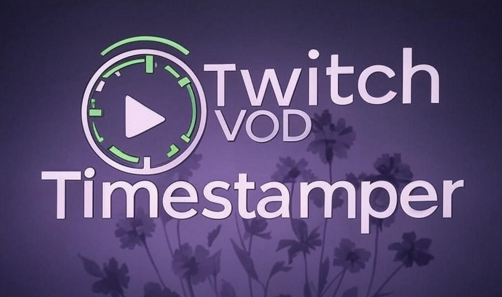

# Twitch VOD Timestamper



A browser extension that lets you create, manage, and share timestamps from Twitch VODs with ease.

## 🎮 Features

- **Quick Timestamping**: Create timestamps with a single hotkey while watching VODs
- **Cross-Platform Sharing**: Auto-generate markdown links for Reddit, Discord, or other platforms
- **Export Options**: Export all timestamps to various formats (JSON, TXT, CSV)
- **Advanced Search**: Search through your timestamp collection with regex support
- **Categories & Tags**: Tag and categorize moments (kills, fails, funny moments, etc.)

## 📋 Installation

### From Stores (Coming Soon)
- Microsoft Edge: Coming first!
- Chrome and Firefox: Coming later

### Manual Installation (Development)

#### Chrome/Edge
1. Clone this repository: `git clone https://github.com/KrishGaur1354/twitch-vods-timestamper.git`
2. Go to `chrome://extensions` or `edge://extensions`
3. Enable "Developer mode"
4. Click "Load unpacked"
5. Select the cloned repository folder

#### Firefox
1. Clone this repository: `git clone https://github.com/KrishGaur1354/twitch-vods-timestamper.git`
2. Go to `about:debugging#/runtime/this-firefox`
3. Click "Load Temporary Add-on..."
4. Navigate to the cloned repository and select `manifest.json`

## 🔧 Usage

### Basic Commands

```bash
# Create a timestamp with description
timestamp add "Amazing play by Shroud" --vod 123456789

# List recent timestamps
timestamp list --recent 3

# Export timestamps
timestamp export --format markdown
```

### Configuration

Create a `.timestamprc` file in your home directory:

```json
{
  "defaultFormat": "markdown",
  "autoExport": true,
  "exportPath": "~/Documents/timestamps/"
}
```

## 📁 Project Structure

```
twitch-stamper/
├── icons/
│   └── ascii-art.png
├── src/
│   ├── background.js
│   ├── content-styles.css
│   ├── content.js
│   └── manifest.json
├── popup-styles.css
├── popup.html
├── popup.js
├── web/
│   ├── index.html
│   └── manifest.json
└── README.md
```

## 🤝 Contributing

Contributions are welcome! Please feel free to submit a Pull Request.

1. Fork the repository
2. Create your feature branch (`git checkout -b feature/amazing-feature`)
3. Commit your changes (`git commit -m 'Add some amazing feature'`)
4. Push to the branch (`git push origin feature/amazing-feature`)
5. Open a Pull Request

## 📜 License

This project is licensed under the MIT License - see the LICENSE file for details.

## 📞 Contact

- GitHub: [@KrishGaur1354](https://github.com/KrishGaur1354)

## 🙏 Acknowledgments

- Made with ❤️ for the Twitch community
- Inspired by the legacy of Justin.tv